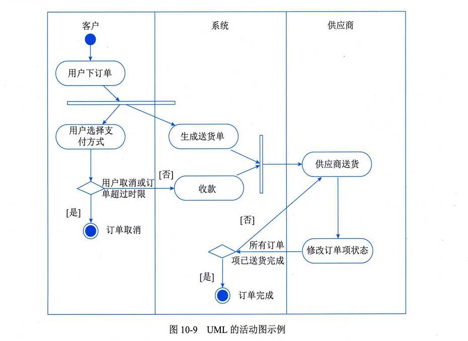

# 1.系统规划与分析
系统分析阶段的基本任务是：系统分析师与用户充分了解、沟通需求后，将双方对新系统的理解呈现为系统需求规格说明书。书本上系统分析主要分为问题分析、业务流程分析、数据与数据流程分析、系统可行性分析、成本效益分析。

## 1.1业务流程分析
方法：价值链分析法、客户关系分析法、供应链分析法、基于ERP的分析法、业务流程重组。
工具：业务流程图/业务活动图
业务流程建模（BPM）：业务流程语言，可以分为文本类和图元类（UML，BPMN）。

UML（统一建模语言）用例图：主要用于业务流程建模。
构造块：包括事物、关系和图。

## 1.2系统可行性分析
经济可行性、技术可行性、法律可行性、用户使用可行性、进度可行性（从项目周期角度看）。

# 2.软件工程概述（选择题/论文题）
软件工程由（方法，工具和过程）三个部分组成。包括（PDCA）四方面，plan，do，check，action。
逆向工程：从低层（代码）推回高层设计。
抽象层次由低到高：实现级、结构级、功能级、领域级。
实现级：包括程序的抽象语法树/符号表等信息，最低级的抽象。
结构级：包括反映程序分量相互依赖关系的信息，如调用图、结构图等。
再工程：逆向工程+新需求+正向工程

## 2.1基于构建的软件工程（Component-BasedSoftwareEngineering，CBSE）（超级重点，选择论文反复考）
CBSE旨在通过复用可重用的软件构件来构造高质量、高效率的应用软件系统。
构件的定义：可组装性、可部署性、文档化、独立性、标准化、可见性。
构件的分类：独立而成熟的构件（隐藏所有接口，数据库管理系统，操作系统）、有限制的构件（提供接口并指出使用条件和前提，python基础类库）、适应性构件（ActiveX组件）、装配的构件（office全家桶）、可修改的构件。

CBSE活动分为两块：一块是面向复用的开发，一块是基于复用的开发。
基于复用的开发，是复用已存在的构件和服务来开发新的应用程序，过程如下：
（1）系统需求概览；（2）识别候选构件；（3）根据发现的构件修改需求；（4）体系结构设计；
（5）构件定制与适配；（6）组装构件，创建系统。

组装方式：顺序组装（构件之间不相互调用，可能被外部程序调用），层次组装（一个调用另一个），叠加组装（新构件接口是原构件接口的组合）。
参数不兼容，操作不兼容，操作不完备。

## 2.2软件过程/生命周期模型（超级重点，选择案例反复考）
要经历从软件定义、软件开发、软件运行、软件维护（软件生命周期方法学），直到被淘汰的全过程。
对软件生命周期中的各项任务给予规程约束的工作模型，称为软件过程开发模型，有时也称为软件生命周期模型。
模型种类包括：
1. 在软件需求完全确定的情况下，使用瀑布模型。
瀑布模型的缺点是：依赖早期进行的需求调查，不能适应需求变化。软件需求的完整性、正确性等很难确定，甚至可能是不现实的。
2. 软件开发初始阶段仅能提供基本需求时，可以使用喷泉模型、螺旋模型、敏捷方法等。
原型模型、演化模型、快速原型模型等。

优点：可以在功能开发后及时测试，以验证需求。

缺点：若让用户过早接触不稳定功能，可能对开发或用户造成负面影响。

螺旋模型等于快速原型+风险分析（螺旋模型是在快速原型的基础上扩展而成），特别适用于庞大复杂并具有高风险的系统。

喷泉模型是一种以用户需求为动力、以对象为驱动的模型，主要用于描述面向对象的软件开发过程。喷泉模型的各个阶段可以交互进行。

V模型：需求分析、概要设计、详细设计、编码，到单元测试、集成测试、系统测试、验收测试。
单元测试的依据是软件详细设计说明书（因为里面有具体的功能说明）。
集成测试的依据是软件概要设计文档（集成测试测的是接口关系，所以需要概要设计文档）。
系统测试的依据是需求分析文档。
验收测试的依据是用户需求。

RUP（统一过程）
RUP是用例驱动的、以体系结构为中心的、迭代和增量的软件开发过程。
RUP的九大核心工作流分别是：业务建模、需求、分析与设计、实现、测试、部署、配置与变更管理、项目管理、环境。

敏捷方法★★★★★（XP极限编程、FDD，水晶系列方法、Scrum。）
敏捷方法是适应型，而非可预测型。其强调开发团队与用户之间的紧密协作，是一种以人为本的开发方式，也是一种迭代增量式的开发过程。
敏捷宣言认为：个体和交互胜过过程和工具，可工作的软件胜过大量文档，客户合作胜过合同谈判，响应变化胜过遵循计划。
适用于规模较小、快速改变的项目。
3. 以形式化开发方法为基础，可以使用变换模型。

# 3.软件过程管理
软件能力成熟度模型CMM：5个成熟度等级：初始级、可重复级、已定义级、已管理级和优化级。
能力成熟度模型集成CMMI：四大知识体系包括：系统工程、软件工程、集成产品与流程开发，以及供应商采购。

# 4.需求工程（★★★★★，选择案例论文）
软件需求工程是包括创建和维护软件需求文档所必须的一切活动的过程。
需求开发包括需求获取、需求分析、编写需求规格说明书和需求验证四个阶段。（货分归验）
需求管理包括需求基线、需求变更处理和需求跟踪等方面的工作。（基变跟）
需求获取包括用户访谈、问卷调查、采样、收集资料、获取文档、参加业务实践等方式。

## 4.1结构化分析方法/建模SA（★★★★★）
主要掌握数据流图的基本概念和图例。
结构化分析方法的基本思想是自顶向下、逐层分解，把一个大问题拆分成若干个小问题。
结构化分析方法中，分析模型的核心是数据字典。围绕这个核心，有三个层次的模型，分别是数据模型（ER图）、功能模型（DFD图）和行为模型（状态转换图）。

### 4.1.1 DFD图（★★★★★）
符号包括数据流（箭头），数据处理/加工（圆弧框），数据存储（三面围栏），外部实体（方框）
数据存储要被外部实体使用，必须要经过加工。

要掌握父子图的平衡和子图的平衡，并结合案例真题，能够找茬并写出错误原因。
几个子图内部平衡主要错误原因：
1.加工只有输入，没有输出。
2.加工只有输出，没有输入。
3.加工应该输出A，实际给出B。
4.只有读没有写，或者只有写没有读。

## 4.2面向对象分析方法/建模（★★★★★）
面向对象分析/建模方法：分为对象模型（类图表示）、动态模型（状态图）、功能模型（用例图）。
对象模式：从结构角度定义系统中有哪些对象，对象包含哪些属性，以及对象之间的关系。
动态模型：动态模型刻画系统或对象在时间维度上的行为变化，说明系统在什么状态下受到何种事件触发，会发生什么行为。通常通过状态图、顺序图等来描述。
功能模型：从用户和业务角度说明系统要做什么，描述系统对外提供的功能及其处理过程，常用数据流图或用例图表示。

对象模型为功能模型和动态模型提供结构基础，而功能模型和动态模型又从行为和时序角度补充对象模型。

### 4.2.1用例模型 ★★★★★
用例模型：构建用例模型需要四个阶段，分别是：
1. 识别参与者。
2. 合并需求，获得用例。
3. 细化用例描述。
4. 调整用例模型。
用例图的元素中，重点记忆关联元素。关联关系一般作用于参与者和用例之间，用横线符号表示。
用例图中主要包括参与者（所有事物）、用例（事件）和通信关联（箭头）三种元素。

### 重点
1. 识别参与者：参与者是系统交互的所有事物，不仅可以由人担当，也可以是其他系统、硬件设备，甚至是系统时钟。参与者一定在系统之外，不是系统的一部分。
2. ★★★★★调整用例模型：

### 4.2.2分析模型（类图） ★★★★★
用例模型：
